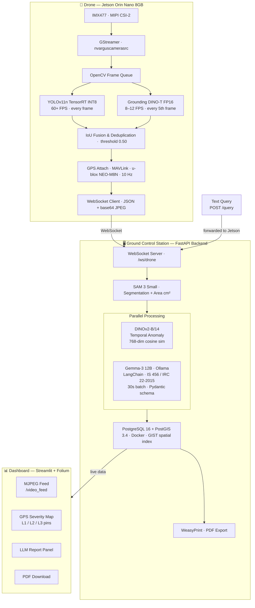
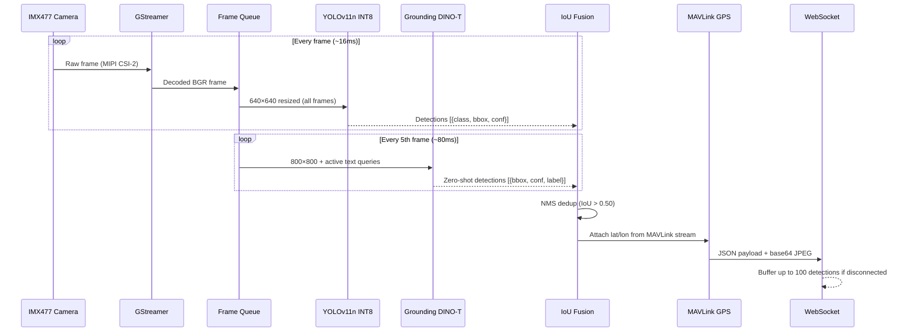
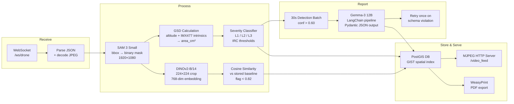

<div align="center">


<br/><br/>

# Hawk-I
### AI-Powered Drone Infrastructure Inspection System

*Zero-shot defect detection · Pixel-accurate segmentation · Temporal anomaly scoring · LLM-generated compliance reports*

<br/>

[](https://python.org)
[](https://fastapi.tiangolo.com)
[](LICENSE)
[](https://equinox.vit.ac.in)

<br/>

> Built for **Equinox '26** — Smart Infrastructure Track

</div>

---

## Table of Contents

- [Overview](#overview)
- [System Architecture](#system-architecture)
- [Edge Pipeline (Jetson)](#edge-pipeline)
- [GCS Pipeline](#gcs-pipeline)
- [AI Model Stack](#ai-model-stack)
- [Benchmark & Performance](#benchmark--performance)
- [Defect Classes](#defect-classes)
- [Severity Classification](#severity-classification)
- [API Reference](#api-reference)
- [Tech Stack](#tech-stack)
- [Project Structure](#project-structure)
- [Getting Started](#getting-started)

---

## Overview

Infrastructure inspection in India is still largely manual — engineers physically climbing bridges, flyovers, and buildings to look for cracks. It's slow, inconsistent, and dangerous. Hawk-I replaces that.

An **NVIDIA Jetson Orin Nano** mounted on a quadcopter runs two AI detectors simultaneously at the edge: a custom **YOLOv11n** (TensorRT INT8, 60+ FPS) for known defect classes, and **Grounding DINO-T** (FP16) for zero-shot text-prompted detection — an engineer types any natural-language defect description into the dashboard and the drone finds it in real time, no retraining required.

Detection payloads stream over WebSocket to a **FastAPI** backend on the ground where **SAM 3** produces pixel-accurate segmentation masks, real-world defect area is calculated in cm² from camera intrinsics and drone altitude, and severity is auto-classified against IRC/IS 456 thresholds. **DINOv2-B/14** compares current inspection frames against stored baseline embeddings via cosine similarity, flagging structural degradation that neither detector would catch. **Gemma-3 12B** generates structured report entries every 30 seconds — grounded in IS 456:2000 and IRC 22-2015 standards — with severity levels, remediation steps, urgency timelines, and INR cost estimates.

Everything runs **fully offline**. No internet required during field inspections.

---

## System Architecture



---

## Edge Pipeline



---

## GCS Pipeline



---

## AI Model Stack

| Model | Location | Task | Input | Latency | Precision |
|---|---|---|---|---|---|
| YOLOv11n | Jetson (TensorRT) | Fixed-class defect detection | 640×640 | ~8ms · 60+ FPS | INT8 |
| Grounding DINO-T | Jetson (TensorRT) | Zero-shot text-prompted detection | 800×800 + text | ~83–125ms · 8–12 FPS | FP16 |
| SAM 3 Small | GCS (GPU) | Pixel-level segmentation + area | 1080p + bbox prompt | ~50–80ms | FP32 |
| DINOv2-B/14 | GCS (GPU) | Temporal anomaly via embedding similarity | 224×224 crop | ~15ms | FP32 |
| Gemma-3 12B | GCS (Ollama) | Structured report generation | Text metadata | ~2–4s / 30s batch | via Ollama |

---

## Benchmark & Performance

### Edge Inference (Jetson Orin Nano 8GB · JetPack 6.0)

| Metric | Value |
|---|---|
| YOLOv11n INT8 — inference latency | ~8ms per frame |
| YOLOv11n INT8 — throughput | 60+ FPS |
| Grounding DINO-T FP16 — throughput | 8–12 FPS (every 5th frame) |
| Dual-thread combined load | ~65–75% GPU utilisation |
| Thermal throttle trigger | 85°C → DINO paused, YOLO continues |
| WebSocket buffer on disconnect | 100 detections (deque) |
| Reconnect strategy | Exponential backoff: 1s → 2s → 4s → max 30s |

### GCS Processing (per detection)

| Stage | Latency |
|---|---|
| SAM 3 Small segmentation | ~50–80ms |
| GSD area calculation | < 1ms |
| DINOv2-B/14 embedding + cosine sim | ~15ms |
| PostGIS write | ~2–5ms |
| End-to-end GCS pipeline | ~70–100ms |

### LLM Report Pipeline

| Metric | Value |
|---|---|
| Report batch interval | 30 seconds |
| Confidence threshold for batch inclusion | > 0.60 |
| Typical generation time (Gemma-3 12B) | 2–4s per batch |
| Schema enforcement | Pydantic + 1 retry on violation |
| Fallback on retry failure | Default template |

### Model Size & Memory

| Model | Disk Size | GPU Memory (approx.) |
|---|---|---|
| YOLOv11n TensorRT INT8 engine | ~5MB | ~300MB |
| Grounding DINO-T FP16 | ~340MB | ~700MB |
| SAM 3 Small | ~400MB | ~1.2GB |
| DINOv2-B/14 (timm) | ~330MB | ~800MB |
| Gemma-3 12B (Ollama) | ~8GB | ~10GB (quantised) |

---

## Defect Classes

Trained on **1,680 annotated images** of Indian infrastructure defects across six classes:

| Class | Description | Typical Trigger |
|---|---|---|
| `crack` | Surface fractures in concrete or masonry | Structural stress, thermal cycling |
| `spalling` | Concrete surface degradation exposing aggregate | Freeze-thaw, corrosion-induced pressure |
| `corrosion` | Metal surface oxidation / rust | Moisture ingress, chloride exposure |
| `exposed_rebar` | Visible reinforcing steel through concrete cover | Advanced spalling, impact damage |
| `efflorescence` | White salt deposits on surface | Active water seepage through concrete |
| `vegetation` | Plant growth on structural surfaces | Joint gaps, drainage failure |

**Training config:** 1,680 images · mAP@0.5: 0.45 · NMS conf: 0.45 · IoU: 0.50 · TensorRT INT8 with 500-frame calibration dataset

---

## Severity Classification

Defect severity is auto-classified based on SAM 3 measured area against IRC-calibrated thresholds:

| Level | Area | Label | Map Pin | Urgency |
|---|---|---|---|---|
| L1 | ≤ 100 cm² | Minor | 🟢 Green | Monitor at next scheduled inspection |
| L2 | 101–500 cm² | Moderate | 🟡 Orange | Repair within 30–90 days |
| L3 | > 500 cm² | Critical | 🔴 Red | Immediate action required (< 7 days) |

**Area formula:**

```
area_cm² = pixel_count × GSD²

GSD (cm/px) = (altitude_m × sensor_width_mm) / (focal_length_mm × image_width_px) × 100
```

Camera intrinsics used: IMX477 — sensor width 6.287mm, focal length 4.74mm, 1920px width.

---

## API Reference

### WebSocket Endpoints

#### `WS /ws/drone`
Receives detection payloads from the Jetson edge device.

**Incoming payload schema:**
```json
{
  "frame_id": "uuid-string",
  "timestamp": 1718000000.123,
  "frame_b64": "<base64-encoded JPEG>",
  "gps": { "lat": 12.9716, "lon": 77.5946, "alt_m": 15.2 },
  "detections": [
    {
      "model": "yolo",
      "class": "crack",
      "confidence": 0.87,
      "bbox": [x1, y1, x2, y2]
    },
    {
      "model": "gdino",
      "class": "rust stain",
      "confidence": 0.73,
      "bbox": [x1, y1, x2, y2]
    }
  ]
}
```

---

#### `WS /ws/dashboard`
Pushes live processed data to the Streamlit dashboard.

**Outgoing push schema:**
```json
{
  "type": "detection",
  "detection_id": "uuid-string",
  "timestamp": 1718000000.456,
  "gps": { "lat": 12.9716, "lon": 77.5946 },
  "class": "crack",
  "severity": "L2",
  "area_cm2": 214.7,
  "anomaly_score": 0.76,
  "annotated_frame_url": "/video_feed"
}
```

---

### HTTP Endpoints

#### `POST /query`
Forwards a text query from the dashboard to the Jetson, updating Grounding DINO's active prompts at runtime.

**Request:**
```json
{
  "query": "rust stain . exposed rebar . white salt deposits"
}
```
**Response:**
```json
{
  "status": "forwarded",
  "active_queries": ["rust stain", "exposed rebar", "white salt deposits"]
}
```

---

#### `GET /detections`
Returns all stored detections as GeoJSON.

**Response:** `GeoJSON FeatureCollection` — each feature has `geometry.coordinates` (lon, lat) and `properties` (class, severity, area_cm2, timestamp, anomaly_score).

---

#### `GET /detections/latest`
Returns detections from the last 5 seconds. Used by Streamlit for polling-based live updates.

**Response:** Same schema as `/detections`, filtered to `timestamp > now - 5s`.

---

#### `GET /video_feed`
MJPEG stream of the latest annotated frame from the Jetson.

**Content-Type:** `multipart/x-mixed-replace; boundary=frame`

---

#### `GET /report/pdf`
Generates and streams a PDF inspection report from all PostGIS detections, sorted by severity descending.

**Response:** `application/pdf` — multi-page report with defect cards, annotated frames, Folium map screenshot, and severity summary table.

---

#### `GET /health`
```json
{
  "status": "ok",
  "uptime_s": 3612.4,
  "drone_connected": true,
  "db_connected": true,
  "detections_total": 142
}
```

---

## Tech Stack

| Layer | Technology |
|---|---|
| **Edge Device** | NVIDIA Jetson Orin Nano 8GB (40 TOPS) |
| **Camera** | Raspberry Pi IMX477 / IMX708 · MIPI CSI-2 · GStreamer |
| **GPS** | u-blox NEO-M8N · MAVLink v2 via pymavlink · 10 Hz |
| **Flight Controller** | Pixhawk 6C · ArduPilot |
| **Backend** | FastAPI 0.115 · Uvicorn · asyncpg · WebSockets |
| **Segmentation** | SAM 3 Small (~400MB) |
| **Anomaly Detection** | DINOv2-B/14 via timm (768-dim embeddings, cosine similarity) |
| **LLM Pipeline** | Ollama · Gemma-3 12B · LangChain 0.3 · Pydantic |
| **Database** | PostgreSQL 16 + PostGIS 3.4 · Docker · GIST spatial index (EPSG:4326) |
| **Dashboard** | Streamlit 1.38 · Folium 0.17 · Plotly 5.24 |
| **PDF Generation** | WeasyPrint 62 |
| **Model Training** | Ultralytics · Google Colab |

---

## Project Structure

```
hawk-i/
├── backend/
│   ├── main.py               # FastAPI app, WebSocket endpoints, MJPEG stream
│   ├── sam3_worker.py        # SAM 3 inference, mask extraction, area calculation
│   ├── dinov2_worker.py      # DINOv2 embeddings, baseline comparison, anomaly scoring
│   ├── llm_worker.py         # Gemma-3 LangChain pipeline, report generation
│   ├── database.py           # asyncpg connection pool, PostGIS CRUD
│   ├── report_gen.py         # WeasyPrint PDF generation
│   ├── video_stream.py       # MJPEG feed endpoint
│   └── models.py             # Pydantic schemas
├── dashboard/
│   ├── app.py                # Streamlit dashboard
│   ├── map_utils.py          # Folium map builder and pin rendering
│   └── report_template.html  # HTML/CSS template for PDF reports
├── data/
│   ├── frames/               # Saved annotated images from missions
│   ├── reports/              # Generated PDF reports
│   └── demo_detections.json  # Pre-recorded data for offline demo mode
├── scripts/                  # Utility scripts
├── tests/                    # Test files and mock drone senders
│
├── hawki_YOLOv11n_Training.ipynb   # Model training notebook
├── hawki_yolo11n.pt                # Trained YOLO weights
├── jetson_client.py                # Jetson-side WebSocket streaming client
├── gcs_client.py                   # GCS-side client utilities
├── config.py                       # Central configuration
├── docker-compose.yml              # PostgreSQL + PostGIS setup
├── requirements.txt
└── .env.example
```

---

## Getting Started

### Prerequisites

- Python 3.10+
- Docker & Docker Compose
- NVIDIA GPU on the GCS machine (for SAM 3 and DINOv2)
- Ollama with Gemma-3 pulled: `ollama pull gemma3:12b`
- *(For edge deployment)* NVIDIA Jetson Orin Nano with JetPack 6.0+

### Setup

```bash
git clone https://github.com/Arvoxis/hawk-i.git
cd hawk-i

pip install -r requirements.txt

cp .env.example .env
# Fill in DB credentials, camera ports, GPS port, and severity thresholds

docker-compose up -d             # Start PostGIS database
python run.py                    # Start FastAPI backend
streamlit run dashboard/app.py   # Launch dashboard
```

### Simulate Drone Feed (no hardware)

```bash
python test_fake_drone.py
```

Replays `data/demo_detections.json` over WebSocket, triggering the full GCS pipeline — SAM 3, DINOv2, LLM reports, and PDF export — without any physical hardware.

### Environment Variables

| Variable | Description | Default |
|---|---|---|
| `DB_HOST` | PostgreSQL host | `localhost` |
| `DB_PORT` | PostgreSQL port | `5432` |
| `DB_NAME` | Database name | `hawki` |
| `DB_USER` / `DB_PASSWORD` | Database credentials | — |
| `JETSON_WS_PORT` | WebSocket port for drone | `8765` |
| `OLLAMA_BASE_URL` | Ollama server endpoint | `http://localhost:11434` |
| `ANOMALY_THRESHOLD` | DINOv2 cosine sim floor | `0.82` |
| `LLM_BATCH_INTERVAL` | Report generation interval (s) | `30` |
| `LLM_CONF_THRESHOLD` | Min confidence for LLM batch | `0.60` |

---

## Documentation

- [Product Requirements Document](./Hawk-I_PRD_v1.0.docx)

---

<div align="center">

*Built at Equinox '26 · Smart Infrastructure Track*

</div>
