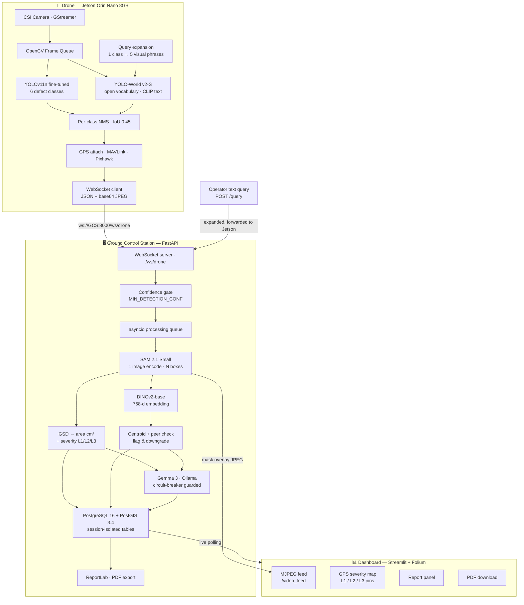
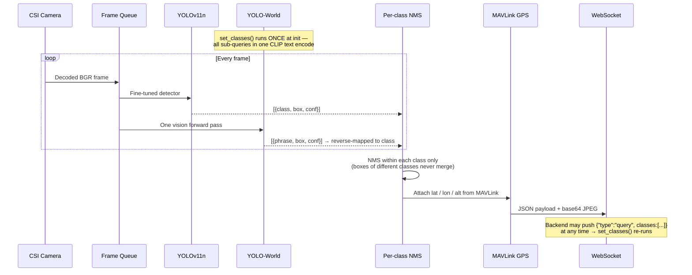
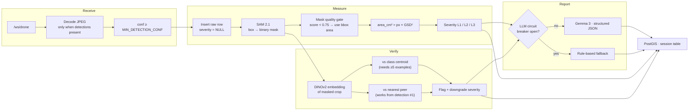

<div align="center">


<br/><br/>

# Hawk-I
### AI-Powered Drone Infrastructure Inspection System

*Open-vocabulary defect detection · Pixel-accurate area measurement · Embedding-based false-positive rejection · LLM-generated inspection reports*

<br/>

[](https://python.org)
[](https://fastapi.tiangolo.com)
[](LICENSE)

<br/>

> Built for **Equinox '26** — Smart Infrastructure Track

</div>

---

## Table of Contents

- [Overview](#overview)
- [System Architecture](#system-architecture)
- [Edge Pipeline](#edge-pipeline)
- [GCS Pipeline](#gcs-pipeline)
- [AI Model Stack](#ai-model-stack)
- [Area Measurement & Severity](#area-measurement--severity)
- [Defect Classes](#defect-classes)
- [Degradation Behaviour](#degradation-behaviour)
- [API Reference](#api-reference)
- [Project Structure](#project-structure)
- [Getting Started](#getting-started)
- [Configuration](#configuration)
- [Testing](#testing)
- [Verified Environment](#verified-environment)
- [Known Limitations](#known-limitations)

---

## Overview

Infrastructure inspection in India is still largely manual — engineers physically climbing bridges, flyovers, and buildings to look for cracks. It's slow, inconsistent, and dangerous. Hawk-I replaces that.

An **NVIDIA Jetson Orin Nano** mounted on a quadcopter runs two detectors at the edge: a **fine-tuned YOLOv11n** for the six known defect classes, and **YOLO-World** for open-vocabulary, text-prompted detection — an engineer types a defect description into the dashboard and the drone starts looking for it in real time, with no retraining.

The open-vocabulary path is the part worth understanding. YOLO-World matches image regions against CLIP text embeddings, and CLIP has rarely seen the phrase *"efflorescence"* paired with a relevant photo. So each canonical defect class is expanded into five plain-language visual descriptions — `"white powder on wall"`, `"salt deposit on surface"` — which are what actually reach the model. All sub-queries across all classes are encoded in a single CLIP forward pass at init, so the expansion costs nothing per frame. Detections are reverse-mapped to their canonical class and merged with per-class NMS. See [docs/MULTI_QUERY.md](docs/MULTI_QUERY.md).

Detection payloads stream over WebSocket to a **FastAPI** backend on the ground, where **SAM 2.1** produces pixel-accurate masks, real-world defect area is computed in cm² from camera intrinsics and drone altitude, and severity is classified against area thresholds. **DINOv2** embeds each masked crop and compares it against previously seen examples of the same class — a detection that looks nothing like its own class is flagged and downgraded, which is what turns a noisy detector into a usable report. **Gemma 3** via Ollama writes the structured inspection entry: severity, remediation, urgency, and an INR cost estimate.

Everything runs **offline** once models are cached locally. No internet is required during a field inspection.

---

## System Architecture


```mermaid
flowchart TD
    subgraph DRONE["🚁  Drone — Jetson Orin Nano 8GB"]
        direction TB
        CAM["CSI Camera · GStreamer"]
        FQ["OpenCV Frame Queue"]
        T1["YOLOv11n fine-tuned<br/>6 defect classes"]
        T2["YOLO-World v2-S<br/>open vocabulary · CLIP text"]
        QMAP["Query expansion<br/>1 class → 5 visual phrases"]
        NMS["Per-class NMS  ·  IoU 0.45"]
        GPS["GPS attach · MAVLink · Pixhawk"]
        WS_OUT["WebSocket client<br/>JSON + base64 JPEG"]

        CAM --> FQ
        FQ --> T1 & T2
        QMAP --> T2
        T1 & T2 --> NMS --> GPS --> WS_OUT
    end

    WS_OUT -- "ws://GCS:8000/ws/drone" --> WS_IN

    subgraph GCS["🖥️  Ground Control Station — FastAPI"]
        direction TB
        WS_IN["WebSocket server · /ws/drone"]
        GATE["Confidence gate<br/>MIN_DETECTION_CONF"]
        QUEUE["asyncio processing queue"]
        SAM["SAM 2.1 Small<br/>1 image encode · N boxes"]
        GSD["GSD → area cm²<br/>+ severity L1/L2/L3"]
        DINO["DINOv2-base<br/>768-d embedding"]
        VERIFY["Centroid + peer check<br/>flag & downgrade"]
        LLM["Gemma 3 · Ollama<br/>circuit-breaker guarded"]
        DB["PostgreSQL 16 + PostGIS 3.4<br/>session-isolated tables"]
        PDF["ReportLab · PDF export"]

        WS_IN --> GATE --> QUEUE --> SAM --> GSD
        SAM --> DINO --> VERIFY
        GSD --> LLM
        VERIFY --> LLM
        GSD & VERIFY & LLM --> DB --> PDF
    end

    SAM -- "mask overlay JPEG" --> FEED
    DB -- "live polling" --> DASH

    subgraph DASH["📊  Dashboard — Streamlit + Folium"]
        direction LR
        FEED["MJPEG feed<br/>/video_feed"]
        MAP["GPS severity map<br/>L1 / L2 / L3 pins"]
        REPORT["Report panel"]
        EXPORT["PDF download"]
    end

    QUERY["Operator text query<br/>POST /query"] -- "expanded, forwarded to Jetson" --> WS_IN
```

---

## Edge Pipeline


```mermaid
sequenceDiagram
    participant CAM as CSI Camera
    participant Q as Frame Queue
    participant Y as YOLOv11n
    participant W as YOLO-World
    participant F as Per-class NMS
    participant GPS as MAVLink GPS
    participant WS as WebSocket

    Note over W: set_classes() runs ONCE at init —<br/>all sub-queries in one CLIP text encode

    loop Every frame
        CAM->>Q: Decoded BGR frame
        Q->>Y: Fine-tuned detector
        Y-->>F: [{class, box, conf}]
        Q->>W: One vision forward pass
        W-->>F: [{phrase, box, conf}] → reverse-mapped to class
    end

    F->>F: NMS within each class only<br/>(boxes of different classes never merge)
    F->>GPS: Attach lat / lon / alt from MAVLink
    GPS->>WS: JSON payload + base64 JPEG

    Note over WS: Backend may push {"type":"query", classes:[...]}<br/>at any time → set_classes() re-runs
```

---

## GCS Pipeline


```mermaid
flowchart LR
    subgraph RECV["Receive"]
        WS["/ws/drone"]
        DEC["Decode JPEG<br/>only when detections present"]
        GATE["conf ≥ MIN_DETECTION_CONF"]
    end

    subgraph MEASURE["Measure"]
        ROW["Insert raw row<br/>severity = NULL"]
        SAM["SAM 2.1<br/>box → binary mask"]
        QUAL["Mask quality gate<br/>score < 0.75 → use bbox area"]
        AREA["area_cm² = px × GSD²"]
        SEV["Severity L1 / L2 / L3"]
    end

    subgraph VERIFY["Verify"]
        EMB["DINOv2 embedding<br/>of masked crop"]
        CENT["vs class centroid<br/>(needs ≥5 examples)"]
        PEER["vs nearest peer<br/>(works from detection #1)"]
        FLAG["Flag + downgrade severity"]
    end

    subgraph REPORT["Report"]
        BREAK{"LLM circuit<br/>breaker open?"}
        OLLAMA["Gemma 3 · structured JSON"]
        RULE["Rule-based fallback"]
    end

    DB["PostGIS · session table"]

    WS --> DEC --> GATE --> ROW --> SAM --> QUAL --> AREA --> SEV
    SAM --> EMB --> CENT --> FLAG
    EMB --> PEER --> FLAG
    SEV --> BREAK
    FLAG --> BREAK
    BREAK -- no --> OLLAMA --> DB
    BREAK -- yes --> RULE --> DB
    SEV --> DB
    FLAG --> DB
```

Only rows with a non-NULL `severity` are visible to the dashboard and PDF, so a
half-processed detection never surfaces as a finding.

---

## AI Model Stack

| Model | Runs on | Task | Weights |
|---|---|---|---|
| **YOLOv11n** (fine-tuned) | Jetson · optionally GCS | Fixed-class defect detection | `models/hawki_yolo11n.pt` — 5.4 MB, in-repo |
| **YOLO-World v2-S** | Jetson | Open-vocabulary text-prompted detection | `yolov8s-worldv2.pt` — auto-downloaded by Ultralytics |
| **SAM 2.1 Hiera Small** | GCS (GPU) | Pixel-level segmentation → area | `models/sam2.1_hiera_small.pt` — 184 MB, downloaded |
| **DINOv2-base** | GCS (GPU) | 768-d embeddings for verification | `facebook/dinov2-base` via `transformers` |
| **Gemma 3 4B** | GCS (Ollama) | Structured report generation | `ollama pull gemma3:4b` |

**A note on names.** `backend/sam3_worker.py` and the `gdino_detections` payload field are historical: the worker runs **SAM 2.1**, and the open-vocabulary detections come from **YOLO-World**, not Grounding DINO. The names are kept because the Jetson-side client and the stored payloads use them; treat them as labels, not as claims about which model is running.

**Performance characteristics.** SAM 2 encodes each frame **once** and then predicts every box inside that single inference context, so per-frame segmentation cost is near-constant in the number of detections rather than linear. Measured end-to-end throughput on the reference GCS (RTX 3050 6 GB laptop) is dominated by the LLM step, not by vision: SAM 2 + DINOv2 complete in well under a second per frame, while a Gemma 3 report takes ~10–12 s on CPU. The published figures below are targets, not measurements from this repository's test runs — re-measure on your own hardware before quoting them.

---

## Area Measurement & Severity

Defect area is derived from the pinhole camera model. This is the measurement the whole report rests on, so it is defined in exactly one place — `backend/config.py` — and pinned by [`tests/test_geometry.py`](tests/test_geometry.py).

```
GSD_m_per_px  = (altitude_m × sensor_width_mm) / (focal_length_mm × image_width_px)
GSD_cm_per_px = GSD_m_per_px × 100

area_cm² = mask_pixel_count × GSD_cm_per_px²
```

The millimetre units of sensor width and focal length cancel, so the raw ratio is already in metres and the `× 100` converts to centimetres. Worked example — IMX477 at 10 m over a 1920 px frame:

```
GSD = (10 × 6.287) / (4.74 × 1920) × 100 = 0.6908 cm/px
A 100 × 100 px mask  →  10 000 × 0.6908²  =  4 772 cm²
```

Severity is assigned from the measured area:

| Level | Area | Label | Map pin | Urgency |
|---|---|---|---|---|
| L1 | < 100 cm² | Minor | 🟢 Green | Monitor at next scheduled inspection |
| L2 | 100 – 500 cm² | Moderate | 🟡 Orange | Repair within 30–90 days |
| L3 | ≥ 500 cm² | Critical | 🔴 Red | Immediate action required |

Thresholds are configurable (`SEVERITY_L2_CM2`, `SEVERITY_L3_CM2`) because they interact strongly with flight altitude — see [Known Limitations](#known-limitations).

Two guards keep bad geometry from producing confident nonsense:

- **Altitude sanity** — a null or sub-2 m altitude reading means the GPS fix is unusable, not that the drone is hovering at 1 m. Such readings are replaced by `DEFAULT_ALT_M` (10 m) and logged, so the estimate degrades instead of collapsing to zero.
- **Mask quality gate** — when SAM 2's predicted IoU falls below `SAM_MASK_QUALITY_THRESHOLD` (0.75), the bounding-box pixel count is used instead of the mask. A `sam_score` of `-1` marks a row whose area is a bbox estimate; the PDF renders those as `~N cm² (est.)`.

---

## Defect Classes

Trained on **1,680 annotated images** of Indian infrastructure defects:

| Class | Description | Typical trigger |
|---|---|---|
| `Crack` | Surface fractures in concrete or masonry | Structural stress, thermal cycling |
| `Spalling` | Concrete surface degradation exposing aggregate | Freeze-thaw, corrosion-induced pressure |
| `RustStain` | Iron oxide staining on concrete | Moisture ingress, chloride exposure |
| `Exposed_reinforcement` | Visible reinforcing steel through concrete cover | Advanced spalling, impact damage |
| `Efflorescence` | White salt deposits on surface | Active water seepage |
| `Scaling` | Peeling / flaking of the surface layer | Surface deterioration, erosion |

Two further classes — `Corrosion` and `Delamination` — exist in the open-vocabulary query map only. YOLO-World can be prompted for them at runtime; the fine-tuned YOLOv11n was not trained on them.

---

## Degradation Behaviour

Field hardware fails. Each stage degrades to a usable result rather than taking the pipeline down:

| Failure | Behaviour |
|---|---|
| No frame in payload | Area estimated from the bounding box; `sam_score = -1` marks it as an estimate |
| SAM 2 returns an empty mask | Falls back to bbox pixel area, logged as a warning |
| SAM 2 mask quality below threshold | Uses bbox area instead of the mask |
| DINOv2 unavailable | Detection is stored without embedding; no similarity search, pipeline continues |
| Fewer than 5 examples of a class | Centroid check is skipped; the peer check still runs from detection #1 |
| **Ollama down or slow** | **Circuit breaker opens after 3 consecutive failures; reports switch to the rule-based generator for 120 s** |
| Drone disconnects | Backend keeps serving stored detections; the MJPEG feed shows a placeholder |
| Dashboard cannot reach the backend | Renders empty panels rather than crashing |

The circuit breaker matters more than it looks. Without it, an unreachable Ollama costs a full 30 s timeout **per detection**, paid serially by the processing worker — which throttles the entire pipeline to roughly one frame every 30 seconds while appearing to work. Reports written by the fallback carry `"generated_by": "rule_based_fallback"`, so template text is always attributable.

---

## API Reference

### WebSocket

#### `WS /ws/drone`
Receives detection payloads from the Jetson; also carries backend → drone commands on the same socket.

**Incoming (Jetson → GCS):**
```json
{
  "timestamp": 1718000000.123,
  "frame_jpeg": "<base64 JPEG>",
  "gps": { "lat": 12.9716, "lon": 77.5946, "alt_m": 15.2 },
  "yolo_detections":  [ { "class": "crack", "conf": 0.87, "box": [x1, y1, x2, y2] } ],
  "gdino_detections": [ { "phrase": "rust stain", "conf": 0.73, "box": [x1, y1, x2, y2] } ]
}
```

**Outgoing (GCS → Jetson):**
```json
{ "type": "query", "query": "crack", "classes": ["thin line in concrete", "fracture in wall", "..."] }
```

#### `WS /ws/dashboard`
Push channel for LLM report cards. The dashboard also polls REST endpoints, so this is supplementary rather than required.

### HTTP

| Method | Path | Purpose |
|---|---|---|
| `GET` | `/` | Liveness string |
| `GET` | `/health` | Full status: DB, drone link, LLM reachability, breaker state, uptime |
| `GET` | `/video_feed` | MJPEG stream — SAM-annotated frame when available, raw frame otherwise |
| `GET` | `/frame/latest` | Single JPEG snapshot |
| `GET` | `/detections/latest?limit=` | Fully-processed detections, newest first |
| `GET` | `/api/detections?limit=&class_name=&severity=` | Filtered detections (comma-separated filters) |
| `GET` | `/detections/llm_reports/latest?seconds=&limit=` | Detections whose report landed recently |
| `POST` | `/query` | Expand a free-text query and forward it to the Jetson |
| `GET` | `/query/current` | Currently active class list |
| `POST` | `/api/segment` | Ad-hoc: one frame + one box + altitude → area in cm² |
| `GET` | `/api/similar/{id}` | Top-3 visually similar past detections by DINOv2 cosine similarity |
| `GET` | `/api/site_health` | Overall site score 0–100 with severity breakdown |
| `GET` | `/api/report/{id}` | LLM report for one detection |
| `GET` | `/api/report/pdf?severity=&class_name=&limit=` | Full inspection report as PDF |
| `GET` | `/api/session` | Current session ID and active table |
| `GET` | `/api/gcs/status` | Live link stats: FPS, frame and detection counts, last GPS |
| — | `/frames/*` | Static mount serving SAM-annotated stills |

Interactive docs are served at `/docs` while the backend is running.

**`GET /health`**
```json
{
  "ok": true,
  "uptime_s": 437.8,
  "session_id": "20260826_232608",
  "db_connected": true,
  "drone_connected": false,
  "detections_total": 10,
  "frames_received": 10,
  "llm": {
    "model": "gemma3:4b",
    "reachable": true,
    "breaker": { "open": false, "consecutive_fails": 0, "cooldown_s": 120.0 }
  },
  "gs_yolo_enabled": false
}
```

`/health` always returns 200 so a monitor can tell "backend unreachable" apart from "backend up, one dependency degraded" — the individual flags carry that distinction.

---

## Project Structure

```
hawk-i/
├── backend/                        # Ground control station service
│   ├── config.py                   # ⭐ Single source of truth for all settings
│   ├── main.py                     # FastAPI app, WebSockets, REST, MJPEG
│   ├── schemas.py                  # Pydantic request/response models
│   ├── database.py                 # asyncpg + PostGIS, session-isolated tables
│   ├── processing_worker.py        # Per-frame pipeline orchestration
│   ├── sam2_segmenter.py           # SAM 2.1 wrapper, lazy load, health check
│   ├── sam3_worker.py              # Batched segmentation + mask overlay (SAM 2.1)
│   ├── dinov2_embedder.py          # Embeddings, centroid & peer verification
│   ├── llm_worker.py               # Ollama access + circuit breaker + batch sweep
│   ├── llm_reporter.py             # Per-detection and mission-summary reports
│   ├── pdf_generator.py            # ReportLab inspection report
│   └── video_stream.py             # In-memory frame store for the live feed
│
├── edge/                           # Jetson-side code
│   ├── config.py                   # CLI + .env config for the drone client
│   ├── jetson_client.py            # Capture → inference → WebSocket stream
│   └── multi_query_yoloworld.py    # ⭐ QUERY_MAP + expansion (shared with backend)
│
├── dashboard/
│   ├── app.py                      # Streamlit ops centre
│   └── utils.py                    # CSS, cards, severity palette
│
├── scripts/                        # Field and diagnostic tooling
│   ├── preflight_check.py          # Pre-flight validator (.env, GCS, WS, DB)
│   ├── check_connections.sh        # Same checks from bash
│   ├── fake_jetson.py              # Drone simulator — streams to a live backend
│   ├── jetson_test_sender.py       # Bare-Python WS stress test (no deps)
│   ├── test_connection.py          # Two-check Jetson ↔ GCS connectivity test
│   └── standalone_receiver.py      # Minimal OpenCV viewer, no backend needed
│
├── tests/
│   ├── test_geometry.py            # GSD / area / severity maths — no deps
│   ├── test_multi_query.py         # Query expansion + NMS — no GPU or model
│   └── test_fake_drone.py          # End-to-end integration against a live stack
│
├── models/                         # Weights (only the 5 MB YOLOv11n is committed)
├── data/                           # Frames, demo payloads, test images
├── notebooks/                      # YOLOv11n training notebook
├── docs/                           # PRD, presentation, multi-query design note
│
├── run.py                          # Backend entry point
├── docker-compose.yml              # PostgreSQL 16 + PostGIS 3.4
├── requirements.txt
└── .env.example                    # Every setting, documented
```

⭐ marks the two files that centralise something previously duplicated: `backend/config.py` holds every tunable, and `edge/multi_query_yoloworld.py` owns the one copy of `QUERY_MAP`.

---

## Getting Started

### Prerequisites

- Python 3.10+
- Docker & Docker Compose (for PostGIS)
- NVIDIA GPU on the GCS for SAM 2 and DINOv2 (CPU works but is slow)
- [Ollama](https://ollama.com/download) with `ollama pull gemma3:4b`
- *(Edge only)* Jetson Orin Nano with JetPack 6.0+

### Setup

```bash
git clone https://github.com/Arvoxis/hawk-i.git
cd hawk-i
```

```bash
pip install torch torchvision --index-url https://download.pytorch.org/whl/cu121
```

```bash
pip install -r requirements.txt
```

SAM 2 is not on PyPI — install it from source and fetch the checkpoint:

```bash
git clone https://github.com/facebookresearch/sam2 && cd sam2 && pip install -e . && cd ..
```

```bash
curl -L -o models/sam2.1_hiera_small.pt https://dl.fbaipublicfiles.com/segment_anything_2/092824/sam2.1_hiera_small.pt
```

Configure, then confirm the settings resolved as you expect:

```bash
cp .env.example .env
```

```bash
python backend/config.py
```

### Run

```bash
docker compose up -d
```

```bash
python run.py
```

```bash
streamlit run dashboard/app.py
```

Backend on `http://localhost:8000` (docs at `/docs`), dashboard on `http://localhost:8501`.

### Fly without hardware

Before every real flight, validate the link:

```bash
python scripts/preflight_check.py
```

To exercise the whole pipeline with no drone attached:

```bash
python scripts/fake_jetson.py
```

This streams frames and detections to `/ws/drone` exactly as the Jetson would, driving SAM 2, DINOv2, the LLM reports, and PDF export end to end.

---

## Configuration

Every setting is read once by `backend/config.py` from `.env`. Nothing else calls `os.getenv`, so `python backend/config.py` prints the effective configuration of the whole system.

The settings most worth knowing:

| Variable | Default | Why it matters |
|---|---|---|
| `GCS_HOST` / `GCS_PORT` | `localhost` / `8000` | Backend address. The dashboard and Jetson both resolve it from here |
| `CAMERA_SENSOR_WIDTH_MM` | `6.287` | **Determines every reported area.** Set it to your actual camera |
| `CAMERA_FOCAL_MM` | `4.74` | Same — the two together define the GSD |
| `SEVERITY_L2_CM2` / `L3_CM2` | `100` / `500` | Severity bands; retune per flight altitude |
| `MIN_DETECTION_CONF` | `0.45` | Confidence floor to enter the pipeline at all |
| `LLM_CONF_THRESHOLD` | `0.60` | Confidence floor to earn an LLM report |
| `LLM_MODEL` | `gemma3:4b` | Any Ollama model that can follow a JSON schema |
| `OLLAMA_NUM_GPU` | unset | Set to `0` to force CPU inference — see below |
| `GS_YOLO_ENABLED` | `0` | Run YOLOv11n on the GCS too, for camera-only payloads |
| `HAWKI_MODELS_DIR` | `./models` | Relocate weights without touching code |

**If Ollama fails with `CUDA error: device kernel image is invalid`,** the host NVIDIA driver is older than the CUDA kernels Ollama ships. Either update the driver, or set `OLLAMA_NUM_GPU=0` in `.env` to run the LLM on CPU. Vision models are unaffected — PyTorch has its own bundled CUDA runtime and keeps using the GPU.

---

## Testing

Two suites need nothing running — no GPU, no database, no model files:

```bash
python tests/test_geometry.py
```

```bash
python tests/test_multi_query.py
```

The integration test needs the full stack up (`docker compose up -d`, `python run.py`):

```bash
python tests/test_fake_drone.py
```

It sends five synthetic frames and asserts twelve properties end to end — database reachability, LLM reachability, WebSocket delivery, that every frame completes processing, non-zero measured areas, report population, embedding presence, similarity-endpoint shape, site-health range, and that the exported PDF is structurally valid. It exits non-zero if any check fails, so it works in CI.

---

## Verified Environment

The pipeline was last run end to end on this configuration, with all 12 integration checks and 36 unit tests passing:

| Component | Version |
|---|---|
| OS | Windows 11 |
| Python | 3.10.11 |
| PyTorch | 2.5.1+cu121 |
| GPU | RTX 3050 6 GB Laptop (driver 546.18) |
| SAM 2 | 1.0 (from source) |
| Ultralytics | 8.4.35 |
| FastAPI / Uvicorn | 0.135.3 / 0.44.0 |
| Streamlit | 1.56.0 |
| PostgreSQL + PostGIS | 16 + 3.4 (Docker) |
| Ollama | 0.32.15, `gemma3:4b` (CPU — see below) |

On this host Ollama could not use the GPU: driver 546.18 predates the CUDA kernels Ollama 0.32.15 ships, and GPU inference aborts with `device kernel image is invalid`. The LLM therefore runs on CPU via `OLLAMA_NUM_GPU=0`, at roughly 10–12 s per report. PyTorch is unaffected and uses the GPU normally.

---

## Known Limitations

Honest notes for anyone extending this.

1. **Severity thresholds interact with flight altitude.** At 12.5 m with a 1280 px frame the GSD is ~1.3 cm/px, so the L2 boundary (100 cm²) is crossed by a region of roughly 60 px — about 8 × 8 pixels. Fly higher and near-everything reads as critical; fly lower and the bands spread out. The thresholds are calibrated for a specific standoff distance and should be retuned per mission profile, which is why they are in `.env`.

2. **A hairline crack is below the sensor's resolving power at altitude.** At 10 m, one pixel covers ~7 mm. Sub-millimetre crack width cannot be measured from that standoff regardless of the model; the pipeline measures the *extent* of a defect region, not crack width.

3. **`transformers` is a hard requirement for offline operation.** Without it DINOv2 falls back to `torch.hub`, which downloads ~330 MB from GitHub and Meta's CDN on first use — which defeats the offline guarantee in the field. Install it before the first flight and confirm the model is cached.

4. **The LLM is the throughput bottleneck.** Vision runs in well under a second per frame; a Gemma 3 report takes seconds. Reports are generated per detection above `LLM_CONF_THRESHOLD`, so a dense frame is slow. The circuit breaker prevents a *failing* LLM from stalling the pipeline, but a *slow* one still gates throughput.

5. **The 30-second batch sweep and the per-detection reporter overlap.** The sweep now only fills rows with no report, so it can no longer overwrite the richer per-detection version — but the two paths still produce differently-shaped prose for the same defect class.

6. **`gdino_detections` and `sam3_worker` are misleading names.** See [AI Model Stack](#ai-model-stack). Renaming them means a coordinated change to the Jetson payload format, which has not been done.

---

## Documentation

- [Product Requirements Document](docs/Hawk-I_PRD_v1.0.docx)
- [Multi-Query YOLO-World design note](docs/MULTI_QUERY.md)

---

<div align="center">

*Built at Equinox '26 · Smart Infrastructure Track*

</div>
